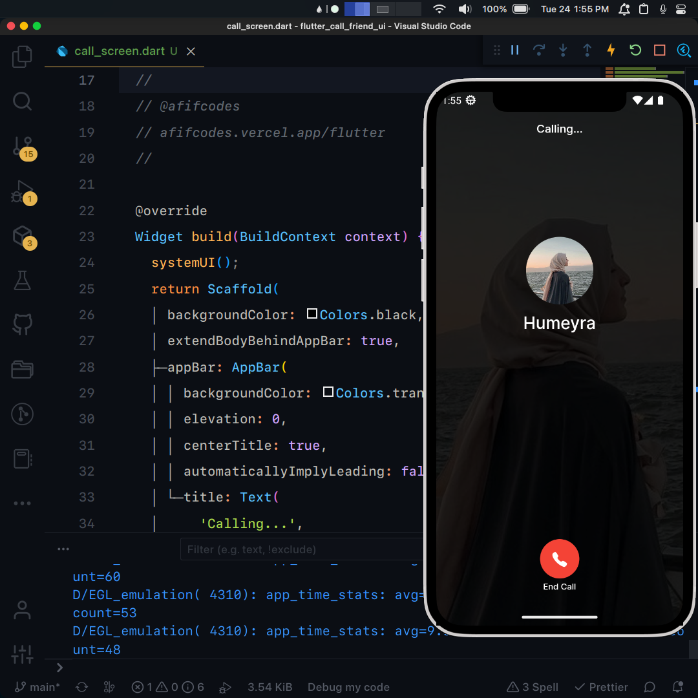

## Flutter UI - Call Friend

```dart
void main() => runApp(MaterialApp(
      debugShowCheckedModeBanner: false,
      onGenerateRoute: (settings) {
        if (settings.name == '/call') {
          var arguments = settings.arguments as CallScreenArguments;
          return RouteAnimation.slide(
              settings,
              CallScreen(
                name: arguments.name,
                imageUrl: arguments.imageUrl,
              ));
        }
        return RouteAnimation.slide(settings, const HomeScreen());
      },
    ));
```

## Development Setup
```
git clone https://github.com/afifcodes/flutter-call-friend-ui.git
cd flutter-call-friend-ui
flutter pub get
flutter run
```

## Screenshots


## Links

* [Website](https://afifcodes.vercel.app/flutter)
* [Youtube channel](https://youtube.com/afifcodes)
* [Instagram](https://instagram.com/afifcodes)